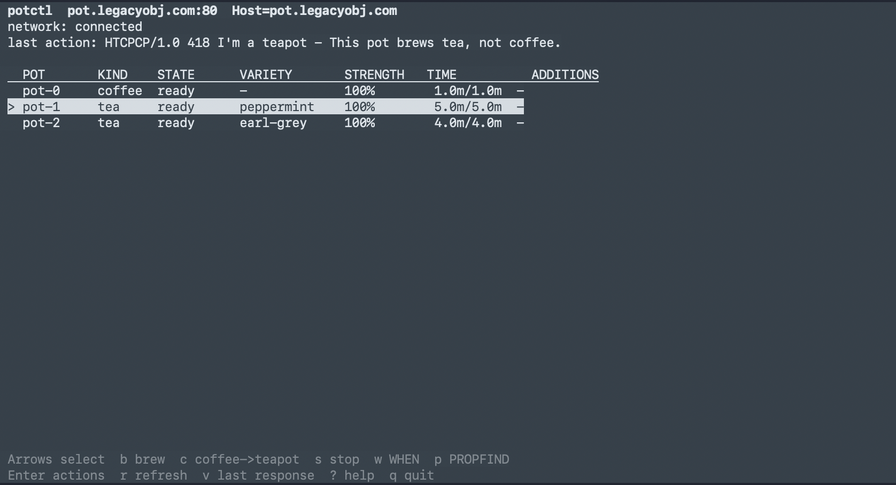

# potd

A standalone implementation of the Hyper Text Coffee Pot Control Protocol written in C.

`potd` implements RFC 2324 (HTCPCP/1.0) and RFC 7168 (HTCPCP-TEA).

## Build

```
make
```

## Usage

```
./potd
```

See `./potd -h` for available options.

## Usage (Client)

```
python3 potctl.py 127.0.0.1 -p 8080
```

See `python3 potctl.py -h` for available options.



## References

RFC 2324 - Hyper Text Coffee Pot Control Protocol (HTCPCP/1.0)

RFC 7168 - HTCPCP-TEA

## License

See `LICENSE`.
